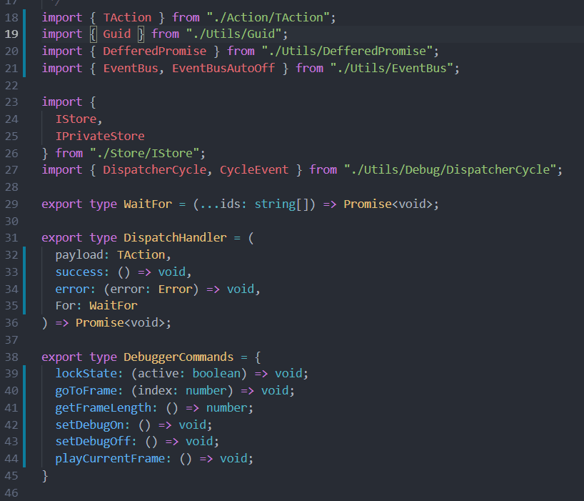

# Shadow-Align README

This extension allows adjacent lines to be aligned on the basis of a regular expression and a group array of characters.



## Features

- Select a group of line filtered by a regular expression
- Align a group of line based on an array of text
- Align a group of line based regular expression named groups
- Store the configuration in a template

There are two ways to use this extension. A simple mode and an advanced one

### Simple mode

We can take a simple example to understand how it works.
The following sample of code is the source we need to format.  
The strategy is to define a regular expression in order to capture several adjacent lines to format

```
let myVar1 = "someValue1";
let myVar12= "someValue12";
let myVar123="someValue123";
let myVar1234    = "someValue1234";
```

The regular expression that can match the lines can be like this :
```
".*?=.*?;"
```
Then after matching the lines, we need to define how to split, here we split on the = sign , then on the ; mark
```
["=",";"]
```
The result will be 
```
let myVar1    = "someValue1"    ;
let myVar12   = "someValue12"   ;
let myVar123  = "someValue123"  ;
let myVar1234 = "someValue1234" ;
```

The full configuration will be like this : 
```json
"shadow.align.templates": {  
  ".*?=.*?;" : ["=",";"]
}
``` 
You can specify several filter, they will be apply to the selected lines

### Advanced mode

We can now take another sample of code, that cannot be formatted by the simple approach.

```
myvar = 22;
otherVar += 12;
anotherVar=100;
```
We need to define our regular expression to match the lines. But the strategy is a little bit different this time. We will not define how to split each line. We will capture each group of a line and then aligne them.

Let's start with the regular expression

```
"(?<variable>.*?)\\s*(?<operator>[\\-\\+\\=\\*\\/]+)\\s*(?<assignment>.+)\\s*(?<end>;)"
```

We have defined 4 named groups. variable, operator, assignment, and end.

Now instead of specifying the group of character to split by, we will just set all group names.

```
["variable","operator","assignment","end"]
```

The result will be this one : 

```
myvar      =  22  ;
otherVar   += 12  ;
anotherVar =  100 ;
```
This result can be enough. But maybe, if we want to be a little fussy, we will want to align the operators based on the equal sign, so on the right. To do that, we can add some information to the group name. Just adding the direction -> after the name, separated by a pipe.

```
["variable","operator|->","assignment","end"]
```

The result will be this one :

```
myvar       = 22  ;
otherVar   += 12  ;
anotherVar  = 100 ;
```

Same for all the numbers ? Easy ...

```
["variable","operator|->","assignment|->","end"]
```

```
myvar       =  22 ;
otherVar   +=  12 ;
anotherVar  = 100 ;
```
Possible values are : ["<-", "--", "->"]

Full configuration sample : 

```
"shadow.align.rgxTemplates": {  
  "(?<variable>.*?)\\s*(?<operator>[\\-\\+\\=\\*\\/]+)\\s*(?<assignment>.+)\\s*(?<end>;)" : ["variable","operator|->","assignment|->","end"]
}
```

## Usage

First, select a bunch of lines
to format, press Alt+Shift+A

## Extension Settings

This extension contributes the following settings:

```typescript
`shadow.align.templates`: {
  [RegExp: string] : Array<string>;
}
`shadow.align.rgxTemplates`: {
  [RegExp: string] : Array<string>;
}
```
## Release Notes

### TBD
 - Allow several patterns for same range of line
 - Allow to filter by languages

## 1.0.6 (current version)
Added alignment for a specific column

### 1.0.5
Added a way to split based on regex named groups

### 1.0.4
Updated readme

### 1.0.3
Minor fixes

### 1.0.0
Initial release of shadow-align
